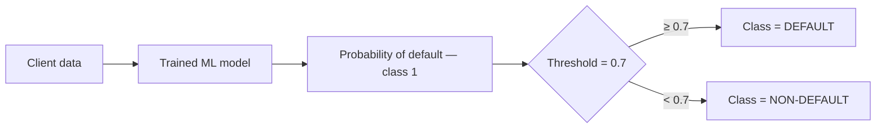

# Base Line Model Analysis - Logistic Regression

## Understand the behavior of a baseline Logistic Regression model in an imbalanced credit risk sample.

-------------

## Dataset Characteristics 
- Binary Classification
    - 0 : non-default
    - 1 : default
- Imbalanced distribution 
    - Almost 80% non-default
    - Almost 20% default
  
---------------

## Experiment 1 : Default Logistic Regression

### Results :
- Accuracy: 0.8013
- ROC-AUC: 0.5446
- Recall (class 1): 0.00
  
### Interpretation :
The model predicted almost all samples as non-default
So we can say that :
- High accuracy is misleading
- The model ignores the minority class
- No defaults are detected
And that this model is npt useful in practice

## Experiment 2 : Blanced Logistic Regression

### Configuration :
```python
LogisticRegression(
    solver="saga",
    max_iter=1000,
    class_weight="balanced"
)
```

### Results :
- Accuracy: 0.5434
- ROC-AUC: 0.5911
- Recall (class 1): 0.61
- Precesion (class 1): 024%
  
### Interpretation :
The model now predicting a significant samples of defaults. But as precision is 24%, it introduces many false positives. Overall accuracy drops from 80% to 54% but usefulness improves
So we can say that :
- High accuracy is misleading
- The model ignores the minority class
- No defaults are detected
And that this model is npt useful in practice

## Conclusion & feedback 
## Key Learning

From this experiment, I realized something very important about working with real data.

First, accuracy can be very misleading when the dataset is imbalanced. In my case, most people are non-default, so the model can get around 80% accuracy just by predicting everyone as safe, which is clearly useless.

Second, recall is very important for this problem. The goal is to detect defaults, so missing them (false negatives) is a big issue. A model that doesn’t catch any default is not useful, even if its accuracy looks good.

Third, there is a trade-off between precision and recall. When I forced the model to pay attention to defaults using `class_weight="balanced"`, the recall improved a lot, but precision became low, meaning many predicted defaults were actually wrong.

Finally, I understood that baseline models can be deceptive. At first glance, the results can look good, but if I don’t analyze the metrics properly, I can completely misunderstand what the model is doing.


## Experiment 3 : Threshold Tuning (=0.3)

### Results 
```bash
Confusion Matrix:
[[  394 31657]
 [   48  7901]]

Evaluation Metrics:
Accuracy: 0.2074
AUC-ROC: 0.5911

Classification Report:
              precision    recall  f1-score   support

           0       0.89      0.01      0.02     32051
           1       0.20      0.99      0.33      7949

    accuracy                           0.21     40000
   macro avg       0.55      0.50      0.18     40000
weighted avg       0.75      0.21      0.09     40000

```
### Interpretation:

Lowering the THRESHOLD from default =0.5 to =0.3 made the model much more aggressive.
    The model now detects almost all defaults (recall for class 1 = 0.99 || 99% which is very high recall)
    But it also wrongly flags a very large number of safe clients as suspicious and defaulters.

In practice, the model predicts `default` for almost everyone. This reduces missed defaults (FN=48).
    But it also creates a huge number of false alarms (FP=31657 which is extremely high)

### Key finding from previous results 

This experiments shows that the decision threshold directly controls the trade-off between :
  - catching more defaults (recall)
  &
  -avoiding false alarms

In other words, when I lower the threshold, the model catches more defaults, which is good. But it also makes more mistakes on safe clients, which is bad and even a diaster for the business objective. 


## Experiment 4 : Threshold Comparison (=0.3, =0.4, =0.5, =0.6, =0.7)

I tested several THRESHOLD to see how the model will behave.

### Results :
Here is the the output of all threshold from 0.3 to 0.7 :
```Bash
(lending-club-ml) PS C:\Users\Utilisateur\...\ML\lending-club-credit-risk> python -m src.main

 ---- THRESHOLD: 0.3 ----

Confusion Matrix:
[[  394 31657]
 [   48  7901]]

Evaluation Metrics:
Accuracy: 0.2074
AUC-ROC: 0.5911

Classification Report:
              precision    recall  f1-score   support

           0       0.89      0.01      0.02     32051
           1       0.20      0.99      0.33      7949

    accuracy                           0.21     40000
   macro avg       0.55      0.50      0.18     40000
weighted avg       0.75      0.21      0.09     40000


 ---- THRESHOLD: 0.4 ----

Confusion Matrix:
[[ 2021 30030]
 [  289  7660]]

Evaluation Metrics:
Accuracy: 0.2420
AUC-ROC: 0.5911

Classification Report:
              precision    recall  f1-score   support

           0       0.87      0.06      0.12     32051
           1       0.20      0.96      0.34      7949

    accuracy                           0.24     40000
   macro avg       0.54      0.51      0.23     40000
weighted avg       0.74      0.24      0.16     40000


 ---- THRESHOLD: 0.5 ----

Confusion Matrix:
[[16890 15161]
 [ 3106  4843]]

Evaluation Metrics:
Accuracy: 0.5433
AUC-ROC: 0.5911

Classification Report:
              precision    recall  f1-score   support

           0       0.84      0.53      0.65     32051
           1       0.24      0.61      0.35      7949

    accuracy                           0.54     40000
   macro avg       0.54      0.57      0.50     40000
weighted avg       0.72      0.54      0.59     40000


 ---- THRESHOLD: 0.6 ----

Confusion Matrix:
[[31106   945]
 [ 7526   423]]

Evaluation Metrics:
Accuracy: 0.7882
AUC-ROC: 0.5911

Classification Report:
              precision    recall  f1-score   support

           0       0.81      0.97      0.88     32051
           1       0.31      0.05      0.09      7949

    accuracy                           0.79     40000
   macro avg       0.56      0.51      0.49     40000
weighted avg       0.71      0.79      0.72     40000


 ---- THRESHOLD: 0.7 ----

Confusion Matrix:
[[32051     0]
 [ 7948     1]]

Evaluation Metrics:
Accuracy: 0.8013
AUC-ROC: 0.5911

Classification Report:
              precision    recall  f1-score   support

           0       0.80      1.00      0.89     32051
           1       1.00      0.00      0.00      7949

    accuracy                           0.80     40000
   macro avg       0.90      0.50      0.44     40000
weighted avg       0.84      0.80      0.71     40000


Pipeline executed successfully.
LogisticRegression(class_weight='balanced', max_iter=1000, solver='saga')
```

### Interpretation :

---

#### Threshold = 0.3

##### 1. What does t=0.3 mean ?


So the model with t=0.3 becomes **less strict** before identifying a client as a defaulter. That means our model will predict more defaults, catch more real defaulters, but it will also make more false alarms.

---

##### 2. Confusion matrix

```
[[  394 31657]
 [   48  7901]]
```

| | Predicted Non-Default | Predicted Default |
|---|---|---|
| **Actual Non-Default** | TN = 394 | FP = 31 657 |
| **Actual Default** | FN = 48 | TP = 7 901 |

- **TN = 394** → clients who are safe AND the model correctly said safe. Very small number compared to the actual safe population.
- **FP = 31 657** → clients who are actually safe BUT the model said they are risky. The model is accusing a huge number of good clients. The model here is too *aggressive*.
- **FN = 48** → clients who are actually risky and the model said safe. Very small number. So the model misses almost no risky client. This is a good sign for t=0.3.
- **TP = 7 901** → clients who are actually risky AND the model correctly predicted them as defaulters. At this threshold the model is very good at catching risky clients.

---

##### 3. Model behavior at t=0.3

From the confusion matrix we can conclude :
- Predicted default (risky) = `FP + TP = 31 657 + 7 901 = 39 558`
- Predicted non-default (safe) = `TN + FN = 394 + 48 = 442`

Out of 40k clients, **39 558 are predicted as default** and only **442 are predicted safe**. So at t=0.3 the model considers almost everyone as risky.

---

##### 4. Accuracy = 0.2074

Correct predictions = `TP + TN = 7 901 + 394 = 8 295` out of 40k clients.

Very low accuracy, and this is because the model flags almost every safe client as risky.

---

##### 5. AUC-ROC = 0.5911

This metric measures how well the model separates risky people from safe people **in general** — independently from the threshold.

| AUC-ROC | Interpretation |
|---|---|
| 0.5 | Random guess |
| 0.6 | Weak, but slightly better than random |
| 0.7+ | Decent |
| 0.8+ | Strong |

Our AUC = 0.59 → the model is still weak at separating risky from safe clients. And notice : **this value never changes across thresholds**. That is because AUC-ROC measures the model itself, not the threshold. The threshold only changes where we draw the line, not how good the model is underneath.

---

##### 6. Classification report

**Class 0 — safe / non-default** (`support = 32 051`)

```
precision = 0.89    recall = 0.01    f1-score = 0.02
```

- `recall = 0.01` → out of 32 051 real safe clients, the model only identifies **1% as safe**. That is a disaster. The model almost never recognizes safe clients.
- `precision = 0.89` → out of clients predicted safe, 89% are actually safe. Obviously high, because the model predicts "safe" for very few people.
- `f1 = 0.02` → very low because recall is catastrophic. The model is simply bad at class 0.

**Class 1 — risky / default** (`support = 7 949`)

```
precision = 0.20    recall = 0.99    f1-score = 0.33
```

- `recall = 0.99` → the model catches 99% of real defaulters. Almost everyone. This is the main strength of this threshold.
- `precision = 0.20` → 80% of clients predicted as risky are actually safe. A major weakness.
- `f1 = 0.33` → despite the very high recall, the low precision keeps the overall performance weak.

---

##### 7. Final conclusion for t=0.3

At threshold 0.3, the model becomes **extremely aggressive**.

It catches almost all real defaults → recall for class 1 reaches 0.99. This is the good side : the model misses very few risky clients.

However, the cost is very high. The model wrongly flags a huge number of safe clients as defaulters → false positives explode → accuracy falls to 0.21 and precision for class 1 stays low at 0.20.

In simple words : **the model now acts like almost everyone is risky**. So even though it is very good at catching defaults, it is not practical because it rejects too many good clients.

---
---

#### Threshold = 0.5

##### 1. What does t=0.5 mean ?


t=0.5 is the **default threshold** used by most classifiers. It means : only flag a client as a defaulter if the model is at least 50% confident they will default. This is the natural middle ground — not too aggressive, not too passive. A balanced starting point.

---

##### 2. Confusion matrix

```
[[16890 15161]
 [ 3106  4843]]
```

| | Predicted Non-Default | Predicted Default |
|---|---|---|
| **Actual Non-Default** | TN = 16 890 | FP = 15 161 |
| **Actual Default** | FN = 3 106 | TP = 4 843 |

- **TN = 16 890** → the model correctly identifies 16 890 safe clients as safe. Much better than t=0.3.
- **FP = 15 161** → still a large number of safe clients wrongly flagged as risky. About half of all safe clients are still misclassified.
- **FN = 3 106** → the model now misses 3 106 real defaulters. The price we pay for being less aggressive.
- **TP = 4 843** → the model still catches 4 843 real defaulters. Weaker than t=0.3 but the model is now more balanced.

---

##### 3. Model behavior at t=0.5

From the confusion matrix we can conclude :
- Predicted default (risky) = `FP + TP = 15 161 + 4 843 = 20 004`
- Predicted non-default (safe) = `TN + FN = 16 890 + 3 106 = 19 996`

Almost exactly **50/50 split** — the model now predicts default and non-default in roughly equal proportions. This makes sense intuitively : at t=0.5 we are right in the center.

---

##### 4. Accuracy = 0.5433

Correct predictions = `TP + TN = 4 843 + 16 890 = 21 733` out of 40k clients.

Accuracy jumps from 0.21 to **54%** compared to t=0.3. But this is still below a random classifier that just predicts the majority class all the time — which would score ~80% given our class imbalance. So accuracy alone is not a useful metric here.

---

##### 5. AUC-ROC = 0.5911

Same as all other thresholds — **AUC never changes**. This confirms again that our model has a weak underlying ability to separate risky from safe clients. Changing the threshold cannot fix a bad model. The real work is in feature engineering and model selection.

---

##### 6. Classification report

**Class 0 — safe / non-default** (`support = 32 051`)

```
precision = 0.84    recall = 0.53    f1-score = 0.65
```

- `recall = 0.53` → the model now correctly identifies 53% of safe clients as safe. Huge improvement from the 1% at t=0.3.
- `precision = 0.84` → when the model says safe, it is correct 84% of the time. Still decent.
- `f1 = 0.65` → much more reasonable. The model is finally learning to recognize safe clients at this threshold.

**Class 1 — risky / default** (`support = 7 949`)

```
precision = 0.24    recall = 0.61    f1-score = 0.35
```

- `recall = 0.61` → the model catches 61% of real defaulters. Down from 99% at t=0.3, but the trade-off is now more realistic.
- `precision = 0.24` → out of clients predicted as risky, only 24% are truly risky. Still low — a lot of false alarms.
- `f1 = 0.35` → slightly better than t=0.3 thanks to a better precision/recall balance, but overall performance for class 1 remains weak.

---

##### 7. Final conclusion for t=0.5

At threshold 0.5, the model finally **behaves like a real classifier** — it does not just flag everyone as risky.

The balance improves significantly. Safe clients are now correctly identified more than half the time, and the model still catches 61% of real defaulters.

However, the weak AUC-ROC of 0.59 is the ceiling that limits everything. No threshold will make this model truly performant. t=0.5 shows us the honest truth : **the model itself needs to be improved** — better features, a stronger algorithm like XGBoost or LightGBM, or better handling of the class imbalance.

In a real lending scenario, t=0.5 would be the starting point for further calibration. It is not a final answer — it is a baseline.

---
---

#### Threshold = 0.7

##### 1. What does t=0.7 mean ?



t=0.7 is **very strict**. The model will only flag a client as a defaulter if it is at least 70% confident they will default. This sounds responsible, but in practice it means the model almost never flags anyone. It becomes too passive.

---

##### 2. Confusion matrix

```
[[32051     0]
 [ 7948     1]]
```

| | Predicted Non-Default | Predicted Default |
|---|---|---|
| **Actual Non-Default** | TN = 32 051 | FP = 0 |
| **Actual Default** | FN = 7 948 | TP = 1 |

- **TN = 32 051** → the model correctly identifies every single safe client as safe. Perfect for class 0 — but for the wrong reasons.
- **FP = 0** → zero false alarms. No safe client is wrongly flagged.
- **FN = 7 948** → the model misses **7 948 out of 7 949 real defaulters**. This is catastrophic. The model lets almost every risky client through.
- **TP = 1** → only **1 real defaulter** is caught. Out of 7 949. The model is essentially blind to defaults.

---

##### 3. Model behavior at t=0.7

From the confusion matrix we can conclude :
- Predicted default (risky) = `FP + TP = 0 + 1 = 1`
- Predicted non-default (safe) = `TN + FN = 32 051 + 7 948 = 39 999`

The model predicts **"safe" for 39 999 out of 40 000 clients**. It has completely stopped detecting defaults. It is no longer a credit risk model — it is just a machine that says "safe" for everyone.

---

##### 4. Accuracy = 0.8013

Correct predictions = `TP + TN = 1 + 32 051 = 32 052` out of 40k clients → **80% accuracy**.

This looks like the best result of all thresholds. But it is completely **misleading**. This accuracy is not coming from good predictions — it is coming from the class imbalance. Since 80% of the dataset is non-default, a model that says "safe" for everyone will automatically score 80% accuracy. This is the classic accuracy trap in imbalanced datasets.

> **Important lesson for your portfolio :** high accuracy does not mean a good model. Always look at the confusion matrix and class-level metrics.

---

##### 5. AUC-ROC = 0.5911

Same as all other thresholds — unchanged. This is a critical point to understand :

The model scored 80% accuracy at t=0.7 and only 21% at t=0.3 — but the AUC is exactly the same at both. That proves that **accuracy is threshold-dependent and misleading**, while **AUC-ROC is threshold-independent and honest**. For imbalanced classification problems like credit risk, AUC-ROC, precision, recall, and F1 are always more informative than raw accuracy.

---

##### 6. Classification report

**Class 0 — safe / non-default** (`support = 32 051`)

```
precision = 0.80    recall = 1.00    f1-score = 0.89
```

- `recall = 1.00` → the model catches 100% of safe clients. Perfect recall for class 0 — but only because it predicts safe for almost everyone.
- `precision = 0.80` → when it says safe, it is correct 80% of the time. But this metric is artificially inflated by the imbalance.
- `f1 = 0.89` → looks great, but again — misleading. This score is driven entirely by the majority class.

**Class 1 — risky / default** (`support = 7 949`)

```
precision = 1.00    recall = 0.00    f1-score = 0.00
```

- `recall = 0.00` → the model catches **0% of real defaulters**. Complete failure for the minority class.
- `precision = 1.00` → when it does predict default (which is only once), it is correct. But predicting correctly 1 time out of 7 949 is not useful at all.
- `f1 = 0.00` → the f1-score for class 1 is zero. The model has completely given up on detecting defaults.

---

##### 7. Final conclusion for t=0.7

At threshold 0.7, the model **completely collapses for the minority class**.

It looks like a great model on paper — 80% accuracy, perfect recall for safe clients, 100% precision for defaults. But these numbers are all tricks of the imbalanced dataset. In reality, the model is useless : it lets 7 948 real defaulters through undetected.

In a real bank, this model would be **dangerous**. High accuracy hides the fact that almost every risky loan is being approved. The financial losses would be enormous.

This threshold teaches us one of the most important lessons in machine learning for finance :

> **Never trust accuracy alone on imbalanced datasets. A model that predicts the majority class for everyone can look perfect while being completely broken.**

---
---

### Summary : Threshold Comparison

| Threshold | Accuracy | Default Recall | Default Precision | Default F1 | Behavior |
|---|---|---|---|---|---|
| **0.3** | 0.21 | **0.99** | 0.20 | 0.33 | Too aggressive — flags everyone |
| **0.5** | 0.54 | 0.61 | 0.24 | 0.35 | Balanced but model is too weak |
| **0.7** | **0.80** | 0.00 | 1.00 | 0.00 | Useless — misses all defaults |

The real takeaway is not about which threshold is best. The real takeaway is that **the model itself is the problem**. AUC-ROC = 0.59 across all thresholds tells us the underlying model barely does better than random. The next step is to build a stronger model before worrying about threshold tuning.